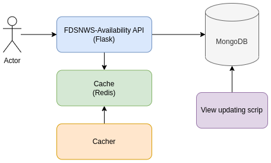

# FDSNWS-Availability Deployment

## Overview

- WFCatalog DB (gray) - database used by the WFCatalog collector and API.
- FDSNWS-Availability API (blue) - Flask-based FDSNWS-Availability implementation.
- FDSNWS-Availability Cache (green) - Redis-based cache to store restriction information.
- FDSNWS-Availability Cacher (orange) - Python-based container to harvest and store restriction information.
- FDSNWS-Availability Update (purple) - JS script to fill the `availability` materialized view using WFCatalog `daily_streams` and `c_segments` collections.



Following implementation requires MongoDB v4.2 or higher.

## Deployment

1. Clone the [https://github.com/EIDA/ws-availability] repository and go to its root
1. Copy `config.py.sample` to `config.py` and adjust it as needed (please notice there are two sections - `RUNMODE == "production"` and `RUNMODE == "test"`; for Docker deployment use the `production` section):

    ```bash
    # WFCatalog MongoDB
    MONGODB_HOST = "localhost" #MongoDB host
    MONGODB_PORT = 27017 #MongoDB port
    MONGODB_USR = "" #MongoDB user
    MONGODB_PWD = "" #MongoDB password
    MONGODB_NAME = "wfrepo" #MongoDB database name
    FDSNWS_STATION_URL = "https://orfeus-eu.org/fdsnws/station/1/query" #FDSNWS-Station endpoint to harvest restriction information from
    CACHE_HOST = "localhost" #Cache host
    CACHE_PORT = 6379 #Cache port
    CACHE_INVENTORY_KEY = "inventory" #Cache key for restriction information
    CACHE_INVENTORY_PERIOD = 0 #Cache invalidation period for `inventory` key; 0 = never invalidate
    CACHE_RESP_PERIOD = 1200 #Cache invalidation period for API response
    ```

1. Build the containers:

    ```bash
    docker-compose -p 'fdsnws-availability' up -d --no-deps --build
    ```

    When the Docker stack is deployed, you will see 3 containers running:

    ```bash
    $ docker ps
    CONTAINER ID   IMAGE                         COMMAND                  CREATED         STATUS        PORTS                      NAMES
    4e3dace01fb0   fdsnws-availability_api       "/bin/bash -c 'gunic…"   10 seconds ago  Up 5 seconds  0.0.0.0:9001->9001/tcp     fdsnws-availability-api
    3c91e0d1c5e6   fdsnws-availability_cacher    "/bin/bash -c 'pytho…"   10 seconds ago  Up 5 seconds  0.0.0.0:11211->11211/tcp   fdsnws-availability-cacher
    d983e64d64a8   redis:7.0-alpine              "docker-entrypoint.s…"   10 seconds ago  Up 5 seconds  0.0.0.0:6379->6379/tcp     fdsnws-availability-cache
    ```

    You can follow the `fdsnws-availability-cacher` container to see the status of restriction information harvesting:

    ```bash
    $ docker logs --follow fdsnws-availability-cacher
    [2023-01-11 09:47:38 +0000] [0] [INFO] Getting inventory from FDSNWS-Station...
    [2023-01-11 09:47:39 +0000] [0] [INFO] Harvesting 33 from https://orfeus-eu.org/fdsnws/station/1/query?level=network: 2M,3T,6A...
    #...
    [2023-02-15 08:31:56 +0000] [0] [INFO] Completed caching inventory from FDSNWS-Station
    ```

    Once `fdsnws-availability-cacher` is completed, it will go down. Harvested information is stored in the Redis DB served by `fdsnws-availability-cache` container. To rebuild the cache, simply restart the container using:

    ```bash
    docker start fdsnws-availability-cacher
    ```

    To automate cache rebuilding process, add following line to `cron`:

    ```bash
    # Rebuild FDSNWS-Availability restriction information cache daily at 3:00 AM
    0 3 * * * docker restart fdsnws-availability-cacher
    ```

    It will harvest and overwrite the restricted information stored in Redis instance.

1. Materialized view
    1. Initial build

        When the stack is initially deployed, the materialized view is not yet in place. To build it, issue the following command:

        ```bash
        # Script started on 2023-02-24
        $ mongosh -u USER -p PASSWORD --authenticationDatabase wfrepo --eval "daysBack=365" views/main.js
        Processing WFCatalog entries using networks: '^.*$', stations: '^.*$', start: '2022-03-24', end: '2023-03-24' completed!
        ```

        It will go throught the documents in `daily_streams` and `c_segments` from last year, extract availability information and store it in the `availability` materialized view.

    1. Daily appension

        To automate availability information appension, add following line to `cron`:

        ```bash
        0 6 * * * cd ~/ws-availability/views && mongosh -u USERNAME -p PASSWORD --authenticationDatabase wfrepo main.js > /dev/null 2>&1
        ```

        It will go throught the documents in `daily_streams` and `c_segments` from last day, extract availability information and append it to the `availability` materialized view. If additional parameters are not provided, script processes data from last day:

        ```bash
        # Script started on 2023-02-24
        $ mongosh -u USERNAME -p PASSWORD --authenticationDatabase wfrepo main.js
        Processing WFCatalog entries using networks: '^.*$', stations: '^.*$', start: '2023-03-23', end: '2023-03-24' completed!
        ```

    1. Back-processing

        Processing can be also executed on a predefined subset of data using `networks`, `stations`, `start` and `end` parameters.

        ```bash
        # Last week
        $ mongosh -u USERNAME -p PASSWORD --authenticationDatabase wfrepo --eval "daysBack=7;" main.js
        Processing WFCatalog entries using networks: '^.*$', stations: '^.*$', start: '2023-03-17', end: '2023-03-24' completed!

        # January 2023
        $ mongosh -u USERNAME -p PASSWORD --authenticationDatabase wfrepo --eval "start='2023-01-01'; end='2023-01-31'" main.js
        Processing WFCatalog entries using networks: '^.*$', stations: '^.*$', start: '2023-01-01', end: '2023-01-31' completed!

        # NL.HGN data between December 2022 and January 2023
        $ mongosh -u USERNAME -p PASSWORD --authenticationDatabase wfrepo --eval "networks='NL'; stations='HGN'; start='2022-12-01'; end='2023-01-31'" main.js
        Processing WFCatalog entries using networks: '^NL$', stations: '^HGN$', start: '2022-12-01', end: '2023-01-31' completed!

        # You can also use regular expressiosn for `networks` and `stations` params
        # Please refer to [docs](https://www.mongodb.com/docs/manual/reference/operator/query/regex/) for details

        # Stations from NL network matching `G*4` template with timespan from 2023-03-01 till 2023-03-02
        $ mongosh -u USERNAME -p PASSWORD --authenticationDatabase wfrepo --eval "networks='NL'; stations='G.*4'; start='2023-03-01'; end='2023-03-02'" main.js
        Processing WFCatalog entries using networks: '^NL$', stations: '^G.*4$', start: '2023-03-01', end: '2023-03-02' completed!

        # Stations from `NL` or `NA` networks with station codes `HGN` or `SABA` and timespan from 2023-03-01 till 2023-03-02
        $ mongosh -u USERNAME -p PASSWORD --authenticationDatabase wfrepo --eval "networks='NL|NA'; stations='HGN|SABA'; start='2023-03-01'; end='2023-03-02'" main.js
        Processing WFCatalog entries using networks: '^NL|NA$', stations: '^HGN|SABA$', start: '2023-03-01', end: '2023-03-02' completed!

        # All stations from networks `NL` and `NA` with timespan from 2023-03-01 till 2023-03-02
        $ mongosh -u jarek -p password123 --authenticationDatabase wfrepo --eval "networks='NL|NA'; start='2023-03-01'; end='2023-03-02'" main.js
        Processing WFCatalog entries using networks: '^NL|NA$', stations: '^.*$', start: '2023-03-01', end: '2023-03-02' completed!
        ```

    1. Indexes

        It is highly suggested to create at least following index in the `availability` materialized view. First, login to your MongoDB instance using `mongosh` and then execute following commands:

        ```bash
        use wfrepo;
        db.availability.createIndex({ net: 1, sta: 1, loc: 1, cha: 1, ts: 1, te: 1 })
        ```

1. Validation

    Now it is time to check if everything is running (remember to change the `net` query parameter). API is exposed by default on port `9001`, let's try to get the landing page:

    ```bash
    $ curl "127.0.0.1:9001"
    <!DOCTYPE html>
    <html lang="en">
      <head>
        <meta charset="utf-8" />
        <meta name="author" content="gempa GmbH" />
        <title>FDSNWS-Availability</title>
      </head>
      <body>
        <h1>FDSNWS Availability Web Service</h1>
        <p>
          The availability web service returns detailed time span information about
          available time series data. Please refer to
          <a href="http://www.fdsn.org/webservices"
            >http://www.fdsn.org/webservice</a
          >
          for a complete service description.
        </p>
    
        <h2>Available URLs</h2>
        <ul>
          <li><a href="query">query</a></li>
          <li><a href="extent">extent</a></li>
          <li><a href="version">version</a></li>
          <li><a href="application.wadl">application.wadl</a></li>
        </ul>
      </body>
    ```

    Get request to the `/extent` method:

    ```bash
    $ curl "127.0.0.1:9001/extent?net=NA&start=2023-02-01"
    #Network Station Location Channel Quality SampleRate Earliest                    Latest                      Updated              TimeSpans Restriction
    NA       SABA             BHE     D       40.0       2023-02-01T00:00:00.000000Z 2023-02-14T00:00:00.000000Z 2023-02-14T07:41:14Z 1         OPEN       
    NA       SABA             BHN     D       40.0       2023-02-01T00:00:00.000000Z 2023-02-14T00:00:00.000000Z 2023-02-14T07:42:07Z 1         OPEN       
    NA       SABA             BHZ     D       40.0       2023-02-01T00:00:00.000000Z 2023-02-14T00:00:00.000000Z 2023-02-14T07:41:41Z 1         OPEN       
    # ...
    ```

    Get request to the `/query` method:

    ```bash
    $ curl "127.0.0.1:9001/query?net=NA&start=2023-02-01"
    #Network Station Location Channel Quality SampleRate Earliest                    Latest                     
    NA       SABA             BHE     D       40.0       2023-02-01T00:00:00.000000Z 2023-02-02T00:00:00.000000Z
    NA       SABA             BHE     D       40.0       2023-02-02T00:00:00.000000Z 2023-02-03T00:00:00.000000Z
    NA       SABA             BHE     D       40.0       2023-02-03T00:00:00.000000Z 2023-02-04T00:00:00.000000Z
    NA       SABA             BHE     D       40.0       2023-02-04T00:00:00.000000Z 2023-02-05T00:00:00.000000Z
    NA       SABA             BHE     D       40.0       2023-02-05T00:00:00.000000Z 2023-02-06T00:00:00.000000Z
    NA       SABA             BHE     D       40.0       2023-02-06T00:00:00.000000Z 2023-02-07T00:00:00.000000Z
    NA       SABA             BHE     D       40.0       2023-02-07T00:00:00.000000Z 2023-02-08T00:00:00.000000Z
    NA       SABA             BHE     D       40.0       2023-02-08T00:00:00.000000Z 2023-02-09T00:00:00.000000Z
    NA       SABA             BHE     D       40.0       2023-02-09T00:00:00.000000Z 2023-02-10T00:00:00.000000Z
    NA       SABA             BHE     D       40.0       2023-02-10T00:00:00.000000Z 2023-02-11T00:00:00.000000Z
    NA       SABA             BHE     D       40.0       2023-02-11T00:00:00.000000Z 2023-02-12T00:00:00.000000Z
    NA       SABA             BHE     D       40.0       2023-02-12T00:00:00.000000Z 2023-02-13T00:00:00.000000Z
    NA       SABA             BHE     D       40.0       2023-02-13T00:00:00.000000Z 2023-02-14T00:00:00.000000Z
    ```

1. Reverse proxy example config

    An example of Apache reverse proxy config:

    ```bash
    # FDSNWS-Availability (Docker)
    ProxyPass /fdsnws/availability/1 <HOST>:9001 timeout=600
    ProxyPassReverse /fdsnws/availability/1 <HOST>:9001 timeout=600
    ```

## Running in development environment

1. Go to the root directory.
1. Copy `config.py.sample` to `config.py` and adjust it as needed.
1. Create the virtual environment:

    ```bash
    python3 -m venv env
    ```

1. Activate the virtual environment:

    ```bash
    source env/bin/activate
    ```

1. Install the dependencies:

    ```bash
    pip install -r requirements.txt
    ```

1. Create Redis instance (mandatory for WFCatalog-based deployment):

    ```bash
    docker run -p 6379:6379 --name cache -d redis:7.0-alpine redis-server --save 20 1 --loglevel warning
    ```

1. Build the cache:

    ```bash
    python3 cache.py
    ```

1. Now you can either:
    1. Run it:

        ```bash
        RUNMODE=test FLASK_APP=start.py flask run

        # Or with gunicorn:
        RUNMODE=test gunicorn --workers 2 --timeout 60 --bind 0.0.0.0:9001 start:app
        ```

    1. Debug it in VS Code (F5) after selecting "Launch (Flask)" config.

## RUNMODE builtin values

- `production`
- `test`

## Tests

Tests can be executed from the respository root using following command:

```bash
PYTHONPATH=./apps/ python3 -m unittest discover tests/
```

## Ideas for improvements

1. Move restriction information from Redis cache directly to the `db.availability` materialized view. This would imply modifying the `views/main.js` script with code harvesting this information directly from the FDSNWS-Station instance.
1. Modify underlying RESIF code from logic based on list of arrays to list of objects/dicts which is native MongoDB response to prevent the object/dict to array casting.

## References

This repository has been forked from [gitlab.com/resif/ws-availability](https://gitlab.com/resif/ws-availability), special thanks to our colleagues at RESIF for sharing their implementation of the FDSNWS-Availability web service. 💐
