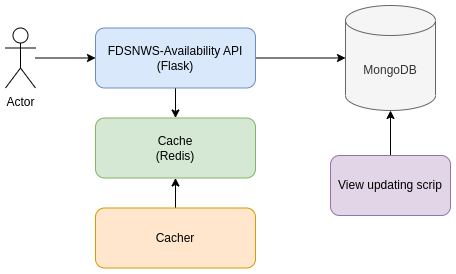

# FDSNWS-Availability

A Flask implementation of the [FDSN Availability web service 1.0](http://www.fdsn.org/webservices/fdsnws-availability-1.0.pdf). It reports the time spans for which time-series data exist, sourced from a WFCatalog MongoDB.

> **Beta testers:** if you are installing or upgrading to the **v1.1.0-beta.1** release, follow [`BETA.md`](BETA.md) — it has the exact step-by-step commands. This README is the general reference.

## Architecture

| Component | Role |
|-----------|------|
| **API** (`fdsnws-availability-api`) | Flask + gunicorn service answering `/query` and `/extent`. |
| **Cache** (`fdsnws-availability-cache`) | Redis — stores the restriction inventory and cached responses. |
| **Cacher** (`fdsnws-availability-cacher`) | Python container running an in-app scheduler (`apps/scheduler.py`) that harvests restriction info and refreshes the materialized view. |
| **WFCatalog MongoDB** | External — holds `daily_streams` / `c_segments`, and the `availability` materialized view the API reads. Requires MongoDB ≥ 4.2. |



## Endpoints

API listens on port `9001` by default.

| Path | Description |
|------|-------------|
| `/query` | Time spans per channel (one row per contiguous segment). GET and POST. |
| `/extent` | One row per channel: earliest/latest + timespan count. GET and POST. |
| `/version` | Service version string. |
| `/application.wadl` | WADL service description. |
| `/` | HTML landing page listing the URLs above. |

```bash
curl "127.0.0.1:9001/extent?net=NA&start=2023-02-01"
#Network Station Location Channel Quality SampleRate Earliest                    Latest                      Updated              TimeSpans Restriction
NA       SABA             BHZ     D       40.0       2023-02-01T00:00:00.000000Z 2023-02-14T00:00:00.000000Z 2023-02-14T07:41:41Z 1         OPEN
```

## Configuration

Copy `config.py.sample` to `config.py` and edit the `RUNMODE == "production"` block. `config.py` is gitignored — your copy is never overwritten by upgrades.

| Key | Description |
|-----|-------------|
| `MONGODB_HOST` / `MONGODB_PORT` | WFCatalog MongoDB location. |
| `MONGODB_USR` / `MONGODB_PWD` | MongoDB credentials (leave empty if no auth). |
| `MONGODB_NAME` | Database name; also used as `authSource`. Default `wfrepo`. |
| `FDSNWS_STATION_URL` | FDSNWS-Station endpoint the cacher harvests restriction info from. |
| `CACHE_HOST` / `CACHE_PORT` | Redis location. |
| `CACHE_INVENTORY_KEY` | Redis key for the restriction inventory. Default `inventory`. |
| `CACHE_INVENTORY_PERIOD` | Inventory cache TTL; `0` = never expire. |
| `CACHE_RESP_PERIOD` | Response cache TTL in seconds. Default `1200`. |
| `SENTRY_DSN` | Sentry DSN. Empty disables Sentry. |
| `SENTRY_TRACES_SAMPLE_RATE` | Trace sample rate `0.0`–`1.0`. |
| `SENTRY_ENVIRONMENT` | **Per-node tag** (e.g. `noa_production`). Must be unique per deployment so Sentry can tell nodes apart. |

The following are optional, read from environment variables with safe defaults (see `apps/settings.py`):

| Env var | Default | Description |
|---------|---------|-------------|
| `MAX_DATA_ROWS` | `2500000` | Row cap; a request exceeding it returns HTTP 413. |
| `MAX_STREAMS` | `2000` | Stream-count cap for a single request. |
| `FANOUT_ENABLED` | `false` | Enable parallel time-window MongoDB queries (see [Performance](#performance)). |
| `FANOUT_MAX_WORKERS` | `4` | Max parallel shards per request when fan-out is on. |
| `FANOUT_MIN_DAYS` | `7` | Below this range size, fan-out is skipped. |
| `FANOUT_WINDOW_DAYS` | `30` | Target shard size in days. |

## Deployment

1. Clone and configure:

   ```bash
   git clone https://github.com/EIDA/ws-availability.git
   cd ws-availability
   cp config.py.sample config.py
   $EDITOR config.py
   ```

2. Build and start:

   ```bash
   docker-compose up -d --build
   ```

   Three containers come up: `fdsnws-availability-api`, `fdsnws-availability-cacher`, `fdsnws-availability-cache`.

3. Reverse proxy (Apache example):

   ```apache
   <Location /fdsnws/availability/1>
     Header add Access-Control-Allow-Origin "*"
   </Location>
   ProxyPass        /fdsnws/availability/1 http://127.0.0.1:9001 timeout=600
   ProxyPassReverse /fdsnws/availability/1 http://127.0.0.1:9001 timeout=600
   ```

## The materialized view

The API reads the `availability` collection, built from WFCatalog's `daily_streams` and `c_segments`.

- **Initial build** (one-time, for a fresh database):

  ```bash
  mongosh -u USER -p PASSWORD --authenticationDatabase wfrepo --eval "daysBack=365" views/main.js
  ```

- **Daily refresh** — the cacher's in-app scheduler runs the update automatically (see [Operations](#operations)). No host cron required.

- **Index** (strongly recommended — without it every query is a collection scan):

  ```javascript
  use wfrepo
  db.availability.createIndex({ net: 1, sta: 1, loc: 1, cha: 1, ts: 1, te: 1 })
  ```

## Operations

The cacher runs an [APScheduler](https://apscheduler.readthedocs.io/) loop (`apps/scheduler.py`) — no host-level cron is needed:

| Time (UTC) | Job | Action |
|------------|-----|--------|
| 03:00 daily | `rebuild-inventory-cache` | Harvest restriction inventory from FDSNWS-Station into Redis. |
| 06:00 daily | `update-availability-view` | Re-process the last 4 days of `daily_streams`/`c_segments` into the `availability` view. |
| on startup | both | Run once when the container starts, so a restart leaves data fresh. |

Both jobs report to Sentry Crons (when `SENTRY_DSN` is set) with `misfire_grace_time=300`, so a brief delay doesn't skip a run. The 4-day reprocessing window means up to 4 consecutive missed days self-heal on the next run.

## Performance

- **Gunicorn workers** — default `--workers 1` (most stable on constrained hosts). Raise in `docker-compose.yml` if you have CPU/RAM headroom; watch `docker logs` for `pthread_create failed`.
- **MongoDB pool** — `maxPoolSize=1` per worker by default (`apps/wfcatalog_client.py`). Total connections = `workers × maxPoolSize`.
- **Parallel fan-out** (opt-in) — set `FANOUT_ENABLED=true` to split long-range queries into day-aligned windows run as concurrent cursors. Best for multi-month queries over a small NSLC selection. When on, peak Mongo connections rise to `workers × FANOUT_MAX_WORKERS`. Off by default; behavior is byte-identical to the single-cursor path when disabled.
- **Thread limits** — `OPENBLAS_NUM_THREADS=1` etc. in `docker-compose.yml` prevent NumPy/ObsPy thread storms. Keep them unless you know your host can handle more.

## Development

Requires Python ≥ 3.13 and [uv](https://docs.astral.sh/uv/).

```bash
cp config.py.sample config.py        # edit for RUNMODE=test
uv sync                              # create venv + install deps from uv.lock

# Redis is required:
docker run -p 6379:6379 --name cache -d redis:7.0-alpine redis-server --save 20 1 --loglevel warning
uv run python cache.py               # build the restriction inventory

# Run the API:
RUNMODE=test uv run gunicorn --workers 2 --timeout 60 --bind 0.0.0.0:9001 start:app
```

## Tests

```bash
uv run pytest tests/
```

## References

Forked from [gitlab.com/resif/ws-availability](https://gitlab.com/resif/ws-availability) — thanks to our colleagues at RESIF for sharing their FDSNWS-Availability implementation. 💐
